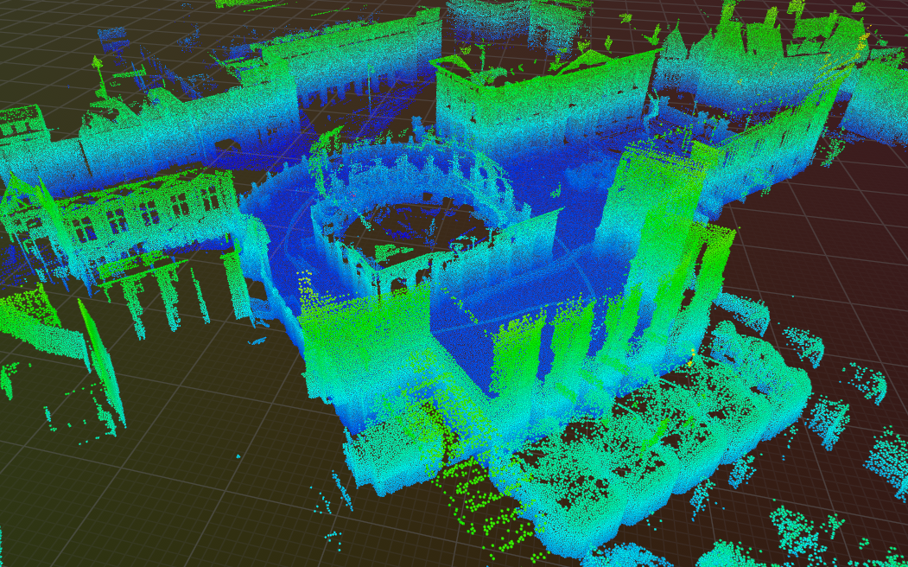
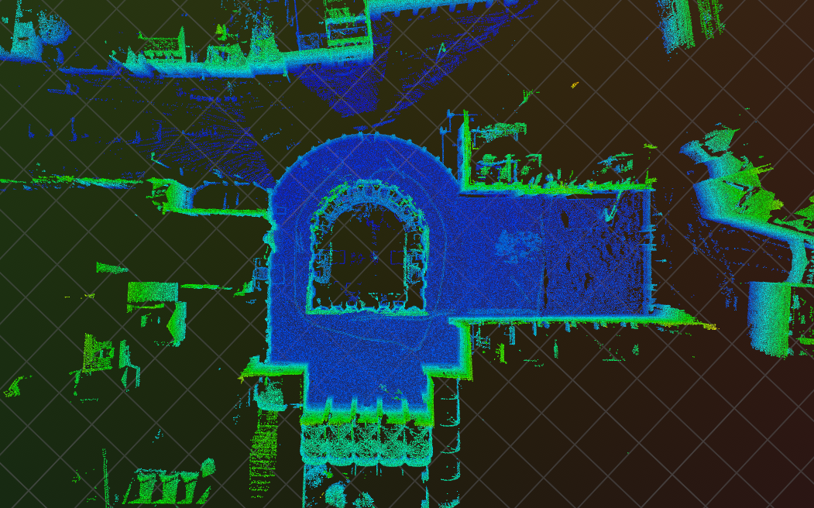
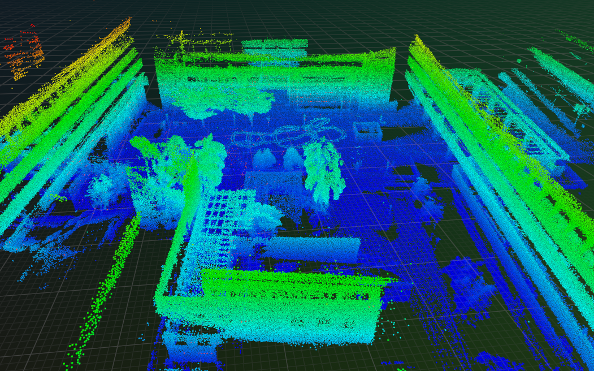

# LiDAR-inertial SLAM

A tightly-coupled LiDAR-inertial odometry and mapping system based on
[FAST-LIO2](https://github.com/hku-mars/FAST_LIO).

IMU measurements are forward-integrated by a midpoint scheme to propagate the state and covariance. Each new scan is deskewed against that trajectory, voxel-downsampled, and registered to an incremental kd-tree map through point-to-plane residuals with a Mahalanobis outlier gate. The estimator is an iterated error-state EKF over a 23-DOF state
($[R, p, v, b_g, b_a, g, R_{ext}, p_{ext}]$, gravity on $S^2$).

Datasets are read using a custom data loader and output is written to `.tum`-files. Omitting ROS was an intentional design choice to keep maximum flexibility. Visualization with Rerun can be enabled as a CMake option.

All credit goes to FAST-LIO2 for the algorithm, this is merely a re-implementation from scratch. The only novel contribution in this implementation is the aforementioned Mahalanobis gating.



_Perspective view of the reconstructed map and estimated trajectory. Sequence EXP21 from the Hilti '22 dataset._



_Top-down view of the same map._



_Map constructed from NTU VIRAL sequence eee_03._

## Prerequisites

- clang-18 / clang++-18 with libc++ (`libc++-18-dev`, `libc++abi-18-dev`)
- CMake ≥ 3.25 and Ninja
- `liblz4-dev` (ROS bag decompression)

Most dependencies (Eigen, Sophus, spdlog, yaml-cpp, nanoflann, CLI11, GoogleTest)
are fetched automatically via CMake FetchContent.

## Build

Configure and build with a preset (`debug`, `release`, or `relwithdebinfo`):

```bash
cmake --preset debug
cmake --build --preset debug
```

The built binary can be found in `build/<preset>/lidar_slam`.

## Run

```bash
./build/release/lidar_slam \
    --format NTU_VIRAL \
    --sequence datasets/ntu_viral/eee_03 \
    --params config/ntu_viral.yaml
```

| Option       |          |                                                                                                 |
| ------------ | -------- | ----------------------------------------------------------------------------------------------- |
| `--format`   | required | Dataset format: `NTU_VIRAL`, `HILTI_22`, or `FAST_LIVO2`.                                       |
| `--sequence` | required | Sequence directory holding the `.bag`.                                                          |
| `--params`   | required | Tunable parameters, see [config/README.md](config/README.md). Use the matching per-format file. |
| `--output`   | optional | Output directory. Defaults to `evaluation/<sequence>`.                                          |

Run from the repository root, the paths above are relative.

| Format       | LiDAR             | Params                   | Ground truth                   |
| ------------ | ----------------- | ------------------------ | ------------------------------ |
| `NTU_VIRAL`  | Ouster OS1        | `config/ntu_viral.yaml`  | in-bag Leica prism             |
| `HILTI_22`   | Hesai PandarXT-32 | `config/hilti_22.yaml`   | sparse control points (`.txt`) |
| `FAST_LIVO2` | Livox Avia        | `config/fast_livo2.yaml` | none                           |

## Evaluation

Each run writes the output trajectory to `.tum`-format
trajectories (`timestamp tx ty tz qx qy qz qw`) into the output directory (along with `gt.tum` if available).

Metrics can be computed offline with [evo](https://github.com/MichaelGrupp/evo).

```bash
python3 -m venv ~/.venvs/evo   # needs python3-venv for ensurepip
~/.venvs/evo/bin/pip install evo
source ~/.venvs/evo/bin/activate.fish # Or equivalent for bash
```

Absolute trajectory error (ATE) and relative pose error (RPE / drift):

```bash
evo_ape tum evaluation/eee_03/gt.tum evaluation/eee_03/estimate_gt.tum \
        --align -r trans_part
evo_rpe tum evaluation/eee_03/gt.tum evaluation/eee_03/estimate_gt.tum \
        --align -r trans_part --delta 1 --delta_unit m
```

Add `--plot` for the trajectory overlay and error-over-time plots.

## Visualization

Live 3D visualization (map, registered scans, trajectory) uses the
[Rerun](https://rerun.io) C++ SDK. It is opt-in: configure with the
`release-rerun` preset, which sets `LIDAR_SLAM_ENABLE_RERUN=ON`.

```bash
cmake --preset release-rerun
cmake --build --preset release-rerun
```

The first build compiles Arrow from source (a few minutes); it is cached
afterward. Normal `debug`/`release` builds do not pull in Rerun.

CMake fetches the SDK (linked into the binary). The **viewer** is a separate GUI
app you install yourself, and it must be the **same version** as the SDK
(0.33.1). Grab the prebuilt binary and drop it somewhere on `PATH`:

```bash
curl -fL -o ~/.cargo/bin/rerun \
  https://github.com/rerun-io/rerun/releases/download/0.33.1/rerun-cli-0.33.1-x86_64-unknown-linux-gnu
chmod +x ~/.cargo/bin/rerun
rerun --version   # expect 0.33.1
```

Alternatives: `cargo install rerun-cli --version 0.33.1 --locked` (compiles from
source), or `pipx install rerun-sdk==0.33.1`.

At run time the app calls `spawn()`, which launches the viewer automatically as
long as `rerun` is on `PATH`:

```bash
./build/release-rerun/lidar_slam
```

If the viewer is not found, `spawn()` logs a warning and the run continues with
visualization disabled. When the pinned SDK version changes, update the viewer to
match or it will refuse to connect.

## Tests

Tests use GoogleTest and are built by default (disable with
`-DLIDAR_SLAM_BUILD_TESTS=OFF` at configure time). Run the suite via CTest:

```bash
ctest --test-dir build/debug --output-on-failure
```

Run a single test by name:

```bash
ctest --test-dir build/debug -R <test_name> --output-on-failure
```

Or run the test binary directly, with GoogleTest filters:

```bash
./build/debug/tests/unit_tests --gtest_filter='IteratedEkf..*'
```

## Formatting

`clang-format-18` (Google style). Run after every change:

```bash
find src tests -name '*.h' -o -name '*.cpp' | xargs clang-format-18 -i
```
